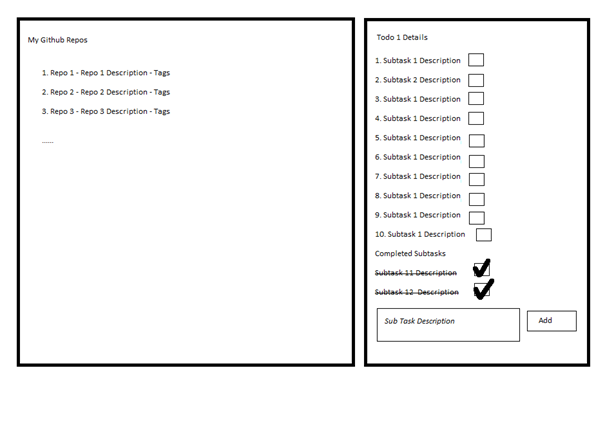

GitHub repo’larını listeleme:

1. Uygulamaya Github Authentication ile girilmeli. <https://docs.github.com/en/developers/apps/building-oauth-apps/authorizing-oauth-apps>
1. Login olan kullanıcının Github’daki repo’ları Github API’leriyle ana sayfada sol panelde listelemeli. <https://docs.github.com/en/rest>
1. Sayfanın sağ panelinde ayrıca basit bir todolist olmalı. Bir todo item’ın altında da subtasklar yaratılabilir. Liste için herhangi bir client storage kullanılabilir.
    1. Todolist listelenirken yanında altındaki tamamlanmamış toplam subtaskler listelenmelidir. Bir todonun altında eğer sadece tamamlanmış subtask varsa, üzeri çizilmelidir.
    1. Detaylarına gittiğimizde subtask eklenip, tamamlandı olarak işaretlenebilmelidir.
    1. Tamamlanan subtaskler altta ayrıca gösterilmelidir.

Ana Sayfa

Todo detayı

